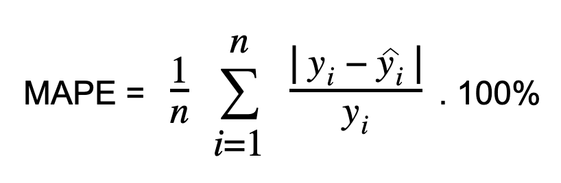

## **Business Problem Understanding**

### **Context**
Kota Daegu dan resminya disebut Kota Metropolitan Daegu merupakan aglomerasi perkotaan terbesar ketiga di Korea Selatan setelah Seoul dan Busan serta daerah metropolitan resmi terbesar keempat di negara Korea Selatan dengan lebih dari 2,2 juta penduduk pada tahun 2023 menurut [**worldpopulationreview**](https://worldpopulationreview.com/world-cities/daegu-population).
Daegu adalah mesin ekonomi Korea selama periode 1960-an hingga 1980-an dan dikenal khususnya untuk industri elektroniknya. Iklim subtropis lembap Daegu ideal untuk menghasilkan apel berkualitas tinggi, sehingga julukannya "Kota Apel" dan Kota Daegu juga dikenal sebagai "Kota Tekstil".
Mayoritas penduduk kota Daegu tinggal di apartemen atau bangunan bertingkat tinggi. Hal ini umum di banyak kota besar di Korea Selatan, di mana lahan yang terbatas telah mendorong pembangunan apartemen.  
Mayoritas penduduk Daegu tinggal di lingkungan perkotaan yang padat, dan ini mencerminkan tren urbanisasi di Korea Selatan di mana orang-orang cenderung bermigrasi ke kota-kota besar dalam mencari peluang pekerjaan dan gaya hidup perkotaan. Berdasarkan situs [**numbeo**](https://www.numbeo.com/cost-of-living/in/Daegu) rata - rata biaya yang dibutuhkan untuk melakukan penyewaan apartemen dengan hanya satu kamar tidur di Kota Baedu berkisar 560,000.00 ₩ (di pusat kota) dan 380,000.00 ₩ (di pinggir kota). Dengan fakta tersebut maka kita dapat menarik kesimpulan bahwa Kota Daegu memiliki tingkat kebutuhan apartemen yang tinggi sehingga kesesuaian harga dari apartemen menjadi sangat penting untuk dilakukan analisis.

### **Problem Statement**
Berdasarkan konteks diatas dapat dilihat bahwa **kebutuhan penyewaan apartemen di Kota Daegu tinggi**, sebagai penyewa tentu kita akan mencari harga apartemen yang murah dengan fasilitas yang sesuai kemudian untuk developer tentu akan menyewakan harga yang lebih tinggi untuk mendapatkan profit yang maksimal. Karena adanya perbedaan pandangan dari kedua pihak tersebut maka **diperlukan sebuah standarisasi penentuan harga apartemen** yang dapat mengakomodir kemampuan penyewa tanpa mengurangi profit yang didapatkan oleh developer dari apartemen.

### **Goals**

Berikut merupakan beberapa tujuan yang ingin dicapai dalam pembuatan machine learning ini:

**Prediksi Harga**: Tujuan utama adalah mengembangkan model machine learning yang dapat memprediksi dengan akurat (**tingkat error MAPE kurang dari 20%**) harga jual apartemen di Kota Daegu. Ini akan membantu pembeli dan penjual memahami nilai pasar dari sebuah properti.

**Wawasan Pasar**: Memperoleh wawasan terkait faktor-faktor yang memengaruhi harga apartemen di Kota Daegu. Ini dapat membantu dalam pengambilan keputusan berdasarkan data, seperti dan variable (faktor) apa yang memengaruhi nilai properti.

**Penentuan Harga yang Kompetitif**: Bagi penjual dan agen real estat, model ini dapat membantu menetapkan harga yang kompetitif untuk menarik pembeli dengan cepat dan memaksimalkan keuntungan.

**Penilaian Risiko**: Bagi pembeli dan investor, memahami faktor-faktor yang memengaruhi harga juga dapat membantu menilai risiko investasi yang terkait dengan sebuah properti.

### **Analytics Approach**
Analisis diawali dengan melakukan pengecekan statistik serta eksplorasi data untuk mengidentifikasi fitur yang berpengaruh terhadap harga apartemen, selanjutnya melakukan cleansing dan preprocessing data untuk tahap persiapan melakukan modelling. Kemudian dilakukan training data pada beberapa benchmark modelling untuk dapat membandingkan tingkat error dari masing - masing model sehingga dapat memilih model dengan tingkat error terendah.

### **Metric Evaluation**

Metrik evaluasi yang digunakan untuk mengitung performance dari machine learning yang digunakan yaitu **RMSE, MAE, dan MAPE**. Pada dataset ini terdapat data yang outliers sehingga jika menggunakan metrik evaluasi **MSE** akan menghasilkan nilai error yang besar sehingga sulit melakukan prediksi maka dari itu digunakan **RMSE** yang merupakan kuadrat dari nilai **MSE** sehingga menghasilkan nilai yang lebih intuitif dan mudah dilakukan intepretasi. Kemudian **RMSE** juga sensitif terhadap outliers sehingga ini dapat bermanfaat untuk dapat mengurangi kesalahan yang besar pada nilai prediksi. Metrik selanjutnya yang digunakan adalah **MAE** merupakan metrik yang cocok untuk menghitung kesalahan absolut yang terjadi pada data dan cocok untuk data yang memiliki outliers. Jika pada **RMSE** kita mendapatkan kesalahan dengan memperhitungkan outliers maka pada **MAE** kita dapat mengintepretasikan kesalahan absolut yang terjadi. **MAPE** merupakan metrik evaluasi yang memiliki satuan persen dengan arti semakin mendekati nilai 0 maka hasil semakin baik. **MAPE** sangat berguna untuk mengintepretasikan hasil error dalam bentuk persen sehingga dapat dengan mudah untuk memahaminya.

**- Root Mean Square Error (RMSE)** adalah salah satu metrik evaluasi yang umum digunakan dalam machine learning, khususnya dalam konteks regresi. Metrik ini digunakan untuk mengukur sejauh mana model regresi cocok dengan data aktual atau sejauh mana perbedaan antara nilai yang diprediksi oleh model dengan nilai sebenarnya.

Berikut adalah deskripsi mengenai RMSE:

1. **Mengukur Kesalahan**: RMSE mengukur kesalahan model regresi dengan menghitung akar kuadrat rata-rata dari perbedaan antara nilai yang diprediksi oleh model dengan nilai sebenarnya (ground truth). Ini berarti bahwa RMSE memberikan bobot lebih besar pada kesalahan besar, yang berarti kesalahan besar akan lebih berdampak pada nilai RMSE daripada kesalahan kecil.

2. **Satuan yang Sama**: RMSE memiliki satuan yang sama dengan target variabel, yang membuatnya mudah diinterpretasikan. Sebagai contoh, jika Anda memodelkan harga apartemen, RMSE akan memiliki satuan mata uang yang sama dengan harga apartemen, seperti dolar atau won.

3. **Proses Perhitungan**: Untuk menghitung RMSE, langkah-langkah berikut dapat diikuti:
   - Selisih antara nilai yang diprediksi oleh model (ŷ) dan nilai sebenarnya (y) dihitung untuk setiap data poin.
   - Kuadrat dari selisih ini dihitung.
   - Rata-rata dari semua kuadrat selisih ini diambil.
   - Akar kuadrat dari rata-rata kuadrat selisih dihitung untuk mendapatkan nilai RMSE.  
     
    Matematisnya, RMSE dapat dihitung seperti gambar formula diatas:
    di mana (n) adalah jumlah data poin, (yj) adalah nilai sebenarnya, dan (ŷj) adalah nilai yang diprediksi oleh model untuk data poin ke-(j).

4. **Interpretasi**: Semakin kecil nilai RMSE, semakin baik model Anda dalam memprediksi data sebenarnya. Sebaliknya, semakin besar nilai RMSE, semakin besar kesalahan prediksi model Anda.

5. **Perbandingan**: RMSE sering digunakan untuk membandingkan kinerja beberapa model regresi berbeda. Model dengan RMSE yang lebih rendah dianggap lebih baik dalam melakukan prediksi.
***
**- Mean Absolute Error (MAE)** adalah salah satu metrik evaluasi yang digunakan dalam statistik dan machine learning untuk mengukur sejauh mana model prediksi berbeda dari nilai sebenarnya. MAE mengukur kesalahan prediksi dengan mengambil rata-rata dari selisih absolut antara prediksi model dan nilai sebenarnya. Semakin rendah nilai MAE, semakin baik kinerja model dalam melakukan prediksi.
Berikut adalah deskripsi terkait MAE:
1. **Mengukur Kesalahan**: MAE mengukur kesalahan model dengan menghitung rata-rata dari selisih absolut antara nilai yang diprediksi oleh model dan nilai sebenarnya.
2. **Bobot yang Sama**: MAE memberikan bobot yang sama pada semua kesalahan, tanpa memperhatikan apakah kesalahan tersebut besar atau kecil.
3. **Proses Perhitungan**: Perhitungan MAE biasanya melibatkan langkah-langkah berikut:
   - Selisih absolut antara nilai yang diprediksi oleh model (ŷ) dan nilai sebenarnya (y) dihitung untuk setiap data poin.
   - Rata-rata dari semua selisih ini diambil untuk mendapatkan nilai MAE.  
      
   Matematisnya, MAE dapat dihitung dengan formula diatas:
   MAE = (1/n) * Σ |yj - ŷj|
   di mana (n) adalah jumlah data poin, (yj) adalah nilai sebenarnya, dan (ŷj) adalah nilai yang diprediksi oleh model untuk data poin ke-(j).

4. **Interpretasi**: Semakin kecil nilai MAE, semakin baik model Anda dalam memprediksi data sebenarnya. MAE memberikan ukuran kesalahan rata-rata dalam satuan yang sama dengan target variabel, sehingga mudah diinterpretasikan.
***
**- MAPE (Mean Absolute Percentage Error)** adalah metrik evaluasi yang digunakan untuk mengukur sejauh mana model prediksi berbeda dari nilai sebenarnya dalam bentuk persentase. MAPE sangat berguna dalam kasus ingin mengukur akurasi prediksi dalam konteks persentase kesalahan relatif terhadap nilai sebenarnya. Metrik ini umumnya digunakan dalam peramalan dan perencanaan untuk mengukur kualitas model prediksi dalam hal persentase kesalahan.
Berikut adalah deskripsi terkait MAPE:
1. **Mengukur Kesalahan**: MAPE adalah metrik yang mengukur kesalahan model dalam bentuk persentase dari kesalahan relatif terhadap nilai sebenarnya.
2. **Satuan**: MAPE berguna ketika Anda ingin memahami sejauh mana model regresi menghasilkan kesalahan dalam bentuk persentase dari nilai sebenarnya.
3. **Proses Perhitungan**: Perhitungan MAPE melibatkan langkah-langkah berikut:
   - Selisih absolut antara nilai yang diprediksi oleh model (ŷ) dan nilai sebenarnya (y) dihitung untuk setiap data poin.
   - Selisih absolut ini dibagi oleh nilai sebenarnya dan kemudian diambil rata-rata untuk menghasilkan persentase kesalahan.
   - Nilai persentase kesalahan ini bisa diubah menjadi persen dengan mengalikan dengan 100.  
    
   Matematisnya, MAPE dapat dihitung dengan formula diatas:
   MAPE = (1/n) * Σ (|yj - ŷj| / |yj|) * 100
   di mana (n) adalah jumlah data poin, (yj) adalah nilai sebenarnya, dan (ŷj) adalah nilai yang diprediksi oleh model untuk data poin ke-(j).

4. **Interpretasi**: Semakin kecil nilai MAPE, semakin baik model Anda dalam memprediksi data sebenarnya dalam bentuk persentase kesalahan relatif.
